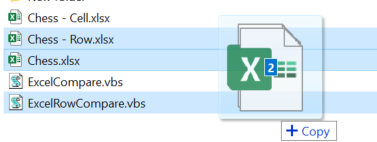
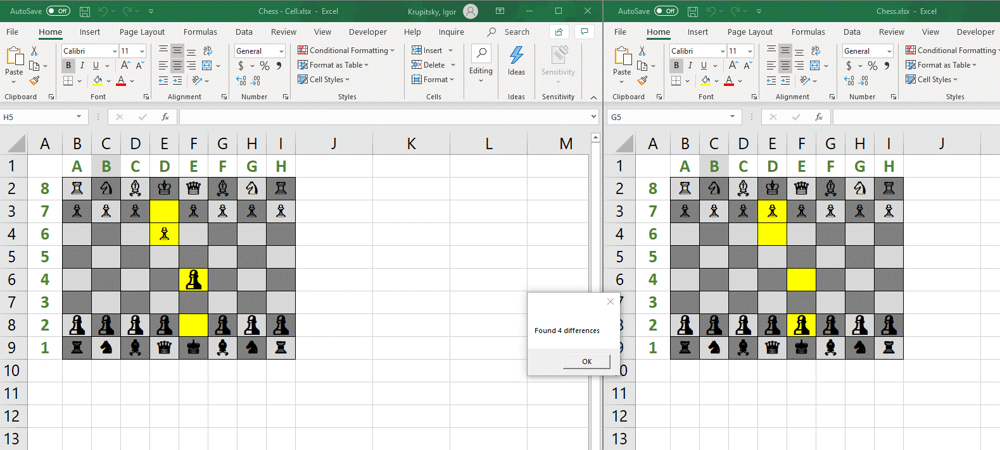
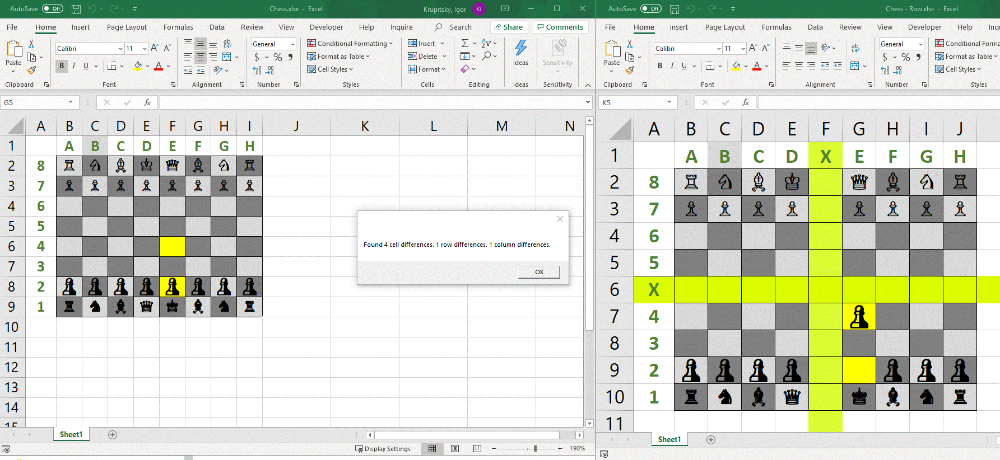

# Compare Two Excel Files

Originally posted here:
https://www.codeproject.com/Tips/5286591/Compare-Two-Excel-Files

How to compare two Excel Files using VBS

## Introduction
Drag and drop two Excel files to compare.

The changes will be highlighted in yellow. Use ExcelCompare.vbs to compare cells.

If your Excel files might have new rows or columns, use ExcelRowCompare.vbs.

## Using the Code

- ExcelRowCompare.vbs compares rows, column and cells. You can modify the code to exclude some worksheets or to save the file at the end. The script might take a long time to run depending on the size of the files.
- ExcelCompare.vbs compares cells. It is smaller and can be more easily understood.
